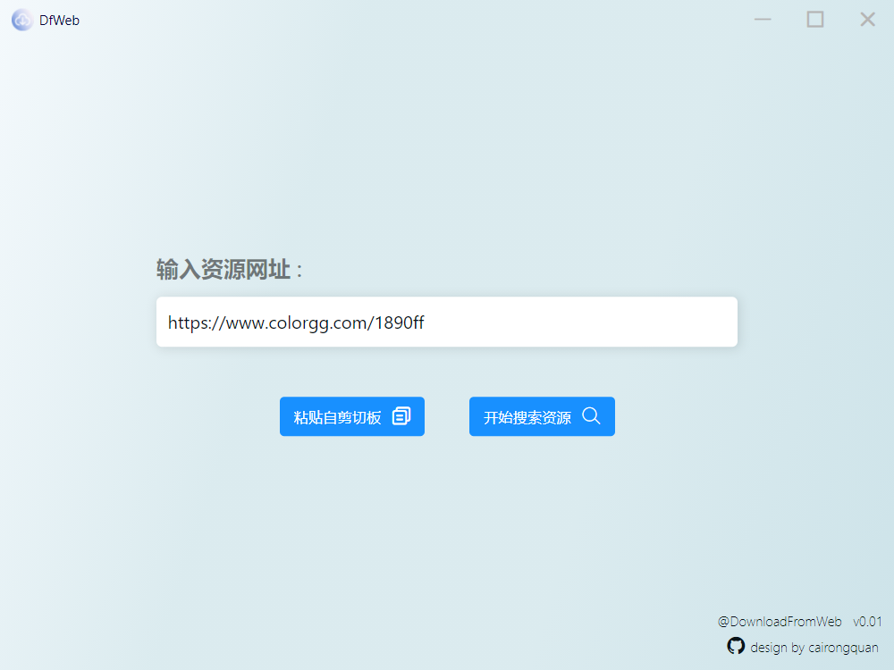

## 
DownloadFromWeb

### 
一个可以从网站页面下载任何资源的开源工具

 基于React、Electron开发

---

### `npm run start`

运行React项目

### `npm run dev`

运行Electron

#### <canter>接下来你就能看到一个友好清爽的界面

- 开发时正好赶上windows11发布 于是便借鉴了windows11设计
- 运行时会自动开启一个nodeJS中间件服务器 在9012端口 确保该端口没有被占用
- 图片资源有些下载不下来 请进行补码操作
- 请确保杀毒软件不会进行干预 如果你熟悉nodeJS开发的 应该会忽视这些建议

